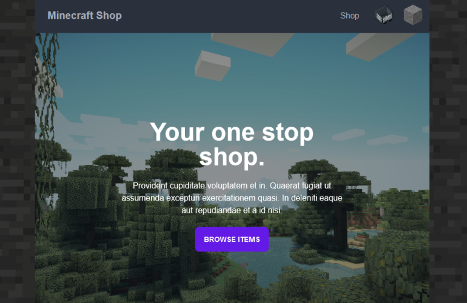

# Team-redux-technology-ui

## Description

Welcome to the Minecraft Shop! An e-commerce website where you can purchase tools and armor for Minecraft(The game). Facilitating the game by being able to purchase items that would take you time and effort gathering material to obtain. Registered users will have access to view the site, purchase items and view their purchase history. Unregistered users will be able to only view the site, and purchase. Last but not least, administrative users will be able to log in and manage inventory (change item prices) as well as regular registered user functionalities.

## Table of contents
* [Technologies](#technologies)
* [Installation](#installation)
* [Website](#website)
* [Github](#github)
* [Authors](#authors)

## Technologies
 - Node.js
 - React.js
 - Vite
 - Tailwind
 - Daisy UI
 - Typescript

 
 
## Installation

- To obtain repository on local computer clone repository API(Link on Website section) and UI(separately) on the command line from GitHub HTTP from Green code button on separate folders: `git clone [GitHub HTTP Link]`

- Once both are installed in local machine run: `npm i OR npm install`

- Create a .env file in the root directory with: "VITE_API_URL=http://localhost:8080"

## Website
- Deployed: http://technology-project-ui.s3-website.us-east-2.amazonaws.com/
- API: https://github.com/220919-WVA-JavaReact/team-redux-technology-api

## GitHub
- Jonny: https://github.com/bluephosphor
- Lesly: https://github.com/leslyr562
- Roger: https://github.com/RaventiGIT
- Lilith: https://github.com/Hek80

## Authors
Made by 
Jonny Andino, 
Lesly Gonzalez, 
Roger Chau, 
Lilith Ryder

### ©️2022 Minecraft The Store
### This application was built with the purpose of satisfying a projects needs. Application is not owned by Minecraft and was not made with the intention of copyright or generating any revenue. Once again application was made to demonstrate web developers capabilities and knowledge ONLY.
